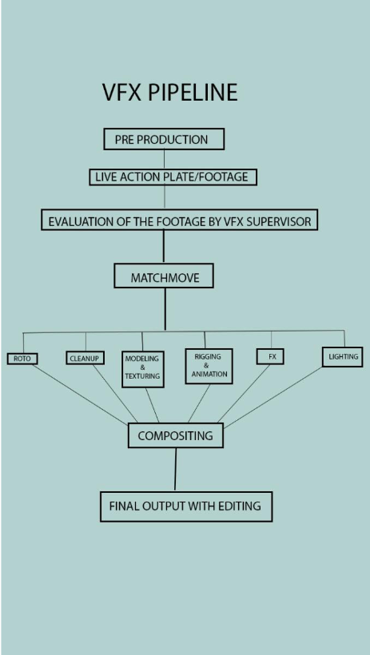

# Msc Project

## 3D animation pipeline

modeling --> rigging --> texturing + lookdev --> animating --> simulating --> effects --> lighting --> rendering --> compositing

https://discourse.techart.online/t/questions-to-film-td-guys/2304/11

## VFX pipeline

awesome: https://github.com/cgwire/awesome-cg-vfx-pipeline

## current choice
- USD 块：
    - https://dl.acm.org/doi/10.1145/3450623.3464663
## Idea list

- 优化图像：
    - https://yiweihu.netlify.app/project/hu2022control/
    - https://github.com/yiwei-hu/Controlling-Material-Appearance-by-Examples?tab=readme-ov-file
- 变形 GSDeformer + VR
    - Goal: write a VR-based UI for GSDeformer, where the user can manipulate trained 3DGS scenes using GSDeformer or even draw new cages for it 
    - Estimated Difficulty: 
        - Easy 4-6 weeks
        - no major technical challenges in sight
    - Would need to know(or learn):
        - How to write a VR app using Unity
        - Roughly know how 3D Gaussian Splatting works
        - Roughly know how GSDeformer works
    - Milestones:
        - 3DGS VR Viewer
        - Add Cage Display
        - Vertex-based Cage Manipulation (select and move around)
        - Get GSDeformer to run
        - (optional) Cage Drawing Tool

    - https://jhuangbu.github.io/gsdeformer/
- USD 节点图：
    - https://github.com/1xinghuan/usdNodeGraph
- USD 块：
    - https://dl.acm.org/doi/10.1145/3450623.3464663
## Difficulty so give up

Generating Procedural Materials from Text or Image Prompts: 
https://yiweihu.netlify.app/uploads/hu2023gen/project