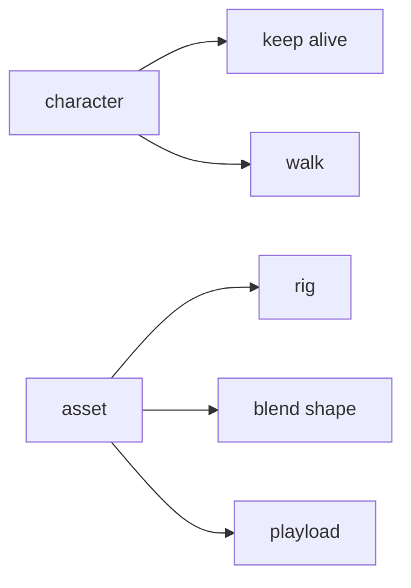

# Msc Project
USD rigging & animation(maya2Unreal)
## 23/06/2024

### LINK:
-https://nccastaff.bournemouth.ac.uk/jmacey/post/USDSchema/USDSchema/#:~:text=A%20USD%20Schema%20is%20a,own%20data%20into%20a%20pipeline.

- https://docs.omniverse.nvidia.com/dev-guide/latest/index.html
- https://www.bilibili.com/read/cv11411037/
- openUSD: 
    -   https://zhuanlan.zhihu.com/p/437422802
    -   http://blog.christianlb.io/building-usd-on-windows-for-python-3
    
## 26/06/2024
Nvidia pre-built USD installation:
- download the python3.7 version USD pre-built source.
- set the env virable: 
    - https://openusd.org/release/tut_usd_tutorials.html#environment-setup
    - add the `.../pip-package` in `$PYTHONPATH`(so you can use modules like PySide2...)
- run the example usd file.

## 01/07/2024

https://fereria.github.io/reincarnation_tech/usd/python/usdskel

https://www.reddit.com/r/Maya/comments/1anuo76/im_looking_for_help_exporting_a_rigged_model_as_a/

https://openusd.org/dev/api/_usd_skel__intro.html

https://docs.omniverse.nvidia.com/kit/docs/pxr-usd-api/latest/pxr/UsdSkel.html

### Reference:
- 导出骨骼信息:
    - 遍历 Maya 中的关节层次结构。
    - 收集每个关节的名称、路径和变换矩阵。
    - 创建一个 USD 文件，并定义一个 USD Skeleton，其中包括关节名称和变换.
- 导出网格信息:
    - 选择和获取一个网格对象的顶点数据。
    - 创建一个 USD 场景，并定义一个 USD Mesh。
    - 将网格的顶点、面顶点数量和面顶点索引数据导入到 USD。

### Issues
- 3 files

## 08/07/2024

### TODO List

- [x] USD schema example: 

### LINK:
API for usdSkel:
https://openusd.org/dev/api/_usd_skel__a_p_i__intro.html
https://docs.omniverse.nvidia.com/kit/docs/pxr-usd-api/latest/pxr/UsdSkel.html
https://openusd.org/release/api/_usd_skel__schema_overview.html
https://fereria.github.io/reincarnation_tech/usd/introduction
https://dev.epicgames.com/community/learning/tutorials/5wew/usd-workflows-with-maya-unreal-engine
https://github.com/Autodesk/maya-usd/tree/dev
https://openusd.org/files/SkinningOM.md.html
https://zenn.dev/remiria/articles/9ac3e31df4da98ba2f0b

even maya-usd can do some simple export task, but there still a lot of bugs need to be solved, so I use the underlying API to export more stable tools designed for skeletal animation.

binding animation to a skeleton
```def Skeleton "Skel" (
        def SkelAnimation "Anim" {
        }
        
        rel skel:animationSource = </Model/Skel/Anim>
    }
```
如果把usda作为资源导入那就会自动拆出来普通的mesh skeleton等，不能保持usda格式
https://www.youtube.com/watch?v=JVXALXerRbw


## 09/07/2024

现在看起来找到的usdskel应该是可以多个DCC直接用的

### LINK:
blend shape in maya(artist):
https://www.youtube.com/watch?v=C29DJYBLh_M
blend shape demo:
https://users.csc.calpoly.edu/~zwood/teaching/csc572/final15/aacosta/index.html


- [ ] character usd

### Analyze



https://github.com/kiryha/Houdini/wiki/Pixar-USD-Python-API

https://github.com/kiryha/Houdini/wiki/python-snippets

https://openusd.org/release/api/usd_skel_page_front.html

- 实例化usdskel:https://openusd.org/release/api/_usd_skel__instancing.html
- binding API: https://openusd.org/release/api/class_usd_skel_binding_a_p_i.html#details
- 简单三关节例子：https://openusd.org/dev/api/_usd_skel__schema_overview.html
- usdskel api:https://openusd.org/dev/api/_usd_skel__a_p_i__intro.html
- https://openusd.org/docs/api/_usd_skel__schema_overview.html#UsdSkel_SchemaOverview_SkinningAnArm

https://openusd.org/release/api/_usd_skel__a_p_i__intro.html#UsdSkel_API_WritingSkels


https://openusd.org/dev/api/_usd_skel__schema_overview.html


## 21/07/2024
### TODO List
- [x] arm usd
- [ ]