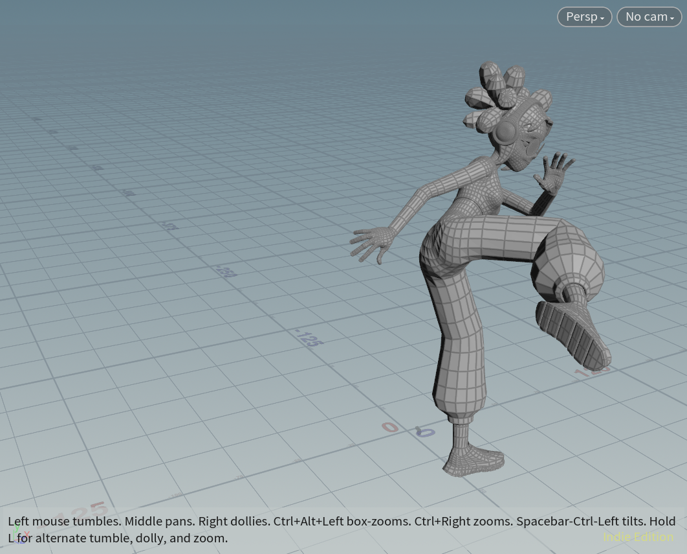
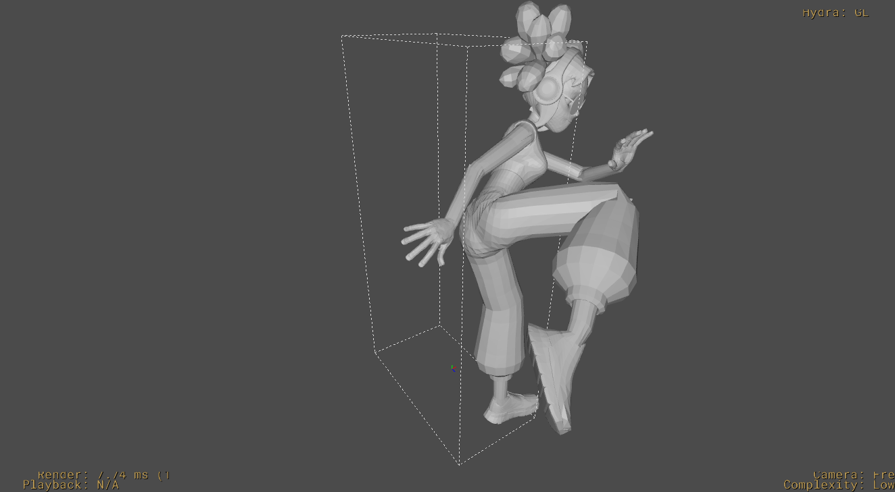

# Houdini USD Character Animation Conversion Tool

This tool automates the conversion of character animations between Houdini and USD (Universal Scene Description) format. It streamlines the workflow for character animation in the gaming and film industries, making it easier to integrate character animations into various pipelines that support USD.

## Features

- **Convenient Conversion**: Easily import and export character animations from within Houdini.
- **Support for Complex Rigs**: Handles complex character rigs and deformations.
- **Support for external web resources**: Provides direct support for fbx format conversion.
- **Pure SOP support for USD**: No need to use LOPs, reducing technical learning costs.

## Installation

TODO:调整网址

1. **Clone the repository**:
   ```bash
   git clone https://github.com/yourusername/houdini-usd-animation-tool.git
   ```
2. **Install HDA files**:
   - Ensure you have Python 3.x and Houdini 18.5 or higher installed.
   - Navigate to the HDA folder directory and install the HDA files contained within. Place the HDA File into the otls Directory:
        - Locate the Houdini `otls` directory, typically found in one of the following paths:
            - Windows: `C:\Users\<YourUsername>\Documents\houdini<Version>\otls`
            - macOS/Linux: `/Users/<YourUsername>/Documents/houdini<Version>/otls`
        - Copy the downloaded HDA file into the otls directory.
        
3. **Restart Houdini (if necessary)**:

    If Houdini is already running, you may need to restart it to load the new HDA.

4. **Using the HDA:**

    Press Tab in the node network to search for and add your HDA node.
Adjust the settings as needed for your project.

## Usage

- Open your Houdini project.
- In the node network editor, press `Tab` to bring up the search menu.
- Create the geometry node and enter it.
- Type the name of your HDA and select it from the list to add it to your network. 

1. **Export Conversion**:
    - Configure the HDA: Select `Usd character export` node.
        - `import`: Fill in the `rest_pose_source`, `anim_source`, `skin_source` with your FBX file path.
        - `setting`: Fill in the `fbx source file` with your FBX file path, fill in the `usd output file` with the path you want to store USD file.
    - Export: Press `save to disk` to export USD file.
2. **Import Conversion**:
    - Configure the HDA: Select `Usd character import` node.
        - `File Import`: Fill in the `USD file path` with your USD file.
        - `Animation`: 
            - `Animation Location`: Select one directory to bake your animation.
            - Then adjust the frame range and press `Bake animation`.
            - `Select baked Animation`: Select the animation your baked.


## Examples

- Check the `example/` directory for sample Houdini project and USD file by using mixamo model.
- import result: 
- export result: 


