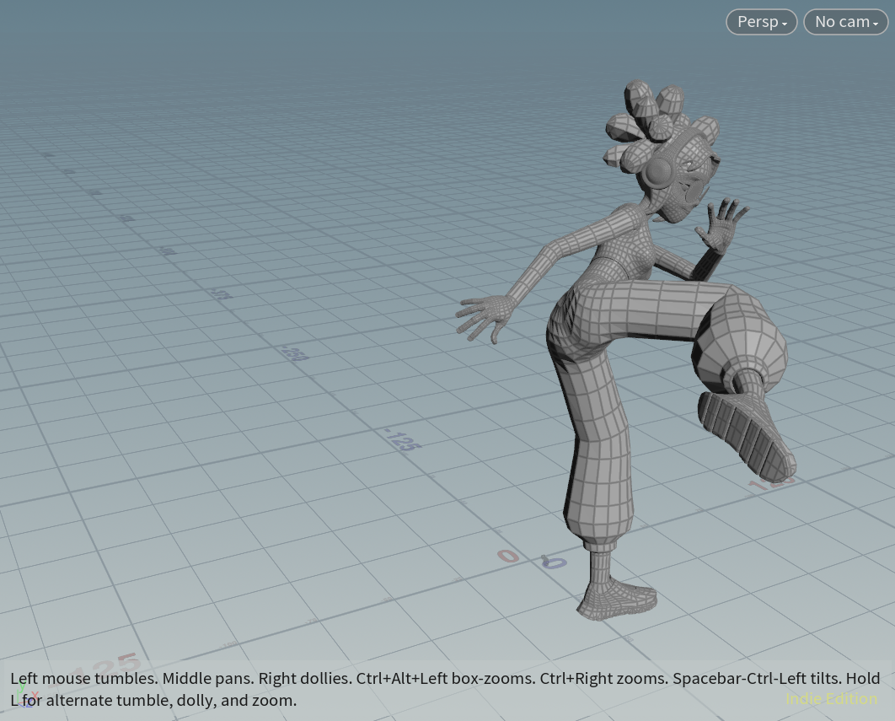
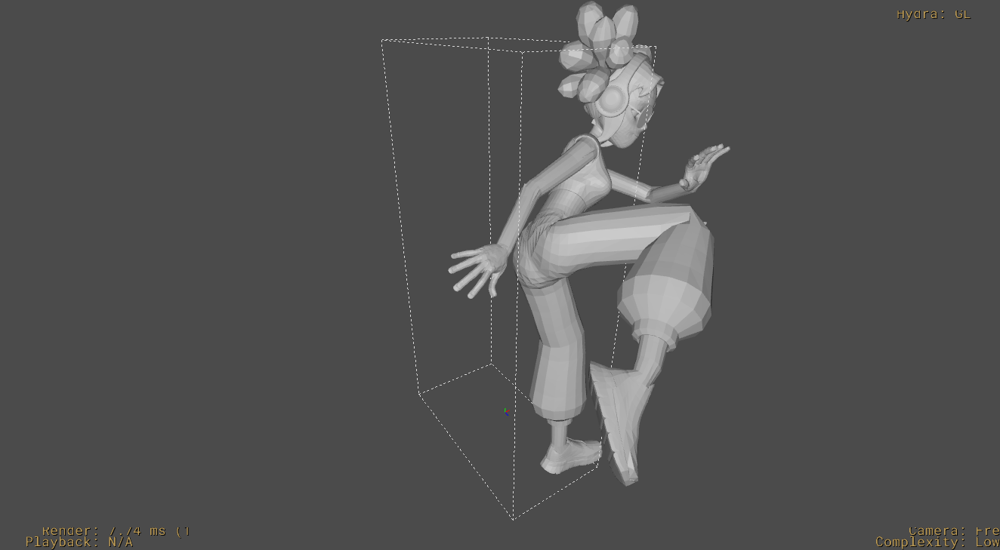

# Msc Project

USD rigging & animation

## Brief:

- export:
    - using fbx and import it in the fbxSkinImport, fbxAnimImport or fbxCharacterImport, then export all infomation to usda file.
- import:
    - import mesh(with joint indices and joint weights)
    - import animation
    - import skeleton
    - combine them with boneDeform
## result:

- I also upload the houdini scene file.

- import result: 

- export result: 

