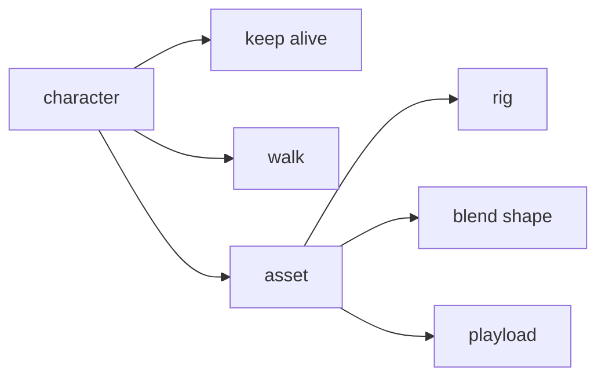

# Msc Project
USD rigging & animation

## 22/07/2024-25/07/2024

### Analyze

### TODO List

**usd houdini**:

**导入**usd文件会有混合形状在SOP失效的问题

- [ ] usd→SOP(without LOP)

**导出**的话就是

- [ ] (boneDeform)node→usd
    - [ ] houdini export usd 
        - [x] geo(mesh) -py
        - [ ] rig
        - [ ] anim
- [ ] fbx(boneDeform)→usd
    - [ ] houdini export usd 
        - [x] geo(mesh) -py
        - [ ] rig
        - [ ] anim
- 不管是节点还是fbx最后的节点都是boneDeform，那么从boneDeform开始比较好

- [ ] character usd
    - [ ] blend shape `OR` without blend shape
### NOTE
- It can't export animations, so just export mesh, rig and anim(3 files):
    https://www.sidefx.com/forum/topic/95553/?page=1#post-420180

### ISSUEs

- Houdini导入USD角色动画，LOP帧数开始不对
- 混合形状SOP不能正常使用

## 21/07/2024
### TODO List
- [x] arm usd

## 09/07/2024

### LINK:
- blend shape in maya(artist): https://www.youtube.com/watch?v=C29DJYBLh_M
- blend shape demo: https://users.csc.calpoly.edu/~zwood/teaching/csc572/final15/aacosta/index.html

- usdskel example import to DCCs: https://www.youtube.com/watch?v=JVXALXerRbw
- 实例化usdskel : https://openusd.org/release/api/_usd_skel__instancing.html
- binding API: https://openusd.org/release/api/class_usd_skel_binding_a_p_i.html#details
- 简单三关节例子：https://openusd.org/dev/api/_usd_skel__schema_overview.html
- usdskel api:
    - https://openusd.org/dev/api/_usd_skel__a_p_i__intro.html
    - https://openusd.org/release/api/usd_skel_page_front.html
- houdini python : https://github.com/kiryha/Houdini/wiki/python-snippets

## 08/07/2024

### TODO List

- [x] USD schema example: 

### LINK:
API for usdSkel:
https://docs.omniverse.nvidia.com/kit/docs/pxr-usd-api/latest/pxr/UsdSkel.html
https://fereria.github.io/reincarnation_tech/usd/introduction
- unreal: https://dev.epicgames.com/community/learning/tutorials/5wew/usd-workflows-with-maya-unreal-engine
- maya: 
    - https://github.com/Autodesk/maya-usd/tree/dev
    - https://zenn.dev/remiria/articles/9ac3e31df4da98ba2f0b
- skinning: 
    - https://openusd.org/files/SkinningOM.md.html
    - https://openusd.org/docs/api/_usd_skel__schema_overview.html#UsdSkel_SchemaOverview_SkinningAnArm

even maya-usd can do some simple export task, but there still a lot of bugs need to be solved, so I use the underlying API to export more stable tools designed for skeletal animation.

## 01/07/2024

https://www.reddit.com/r/Maya/comments/1anuo76/im_looking_for_help_exporting_a_rigged_model_as_a/

https://docs.omniverse.nvidia.com/kit/docs/pxr-usd-api/latest/pxr/UsdSkel.html

### Reference:
- 导出骨骼信息:
    - 遍历 Maya 中的关节层次结构。
    - 收集每个关节的名称、路径和变换矩阵。
    - 创建一个 USD 文件，并定义一个 USD Skeleton，其中包括关节名称和变换.
- 导出网格信息:
    - 选择和获取一个网格对象的顶点数据。
    - 创建一个 USD 场景，并定义一个 USD Mesh。
    - 将网格的顶点、面顶点数量和面顶点索引数据导入到 USD。

## 26/06/2024
Nvidia pre-built USD installation:
- download the python3.7 version USD pre-built source.
- set the env virable: 
    - https://openusd.org/release/tut_usd_tutorials.html#environment-setup
    - add the `.../pip-package` in `$PYTHONPATH`(so you can use modules like PySide2...)
- run the example usd file.

